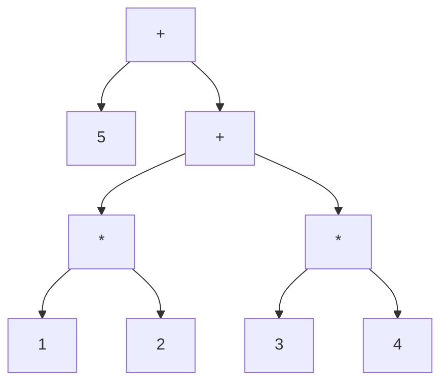

# Flex和Bison协同工作（下）

上一篇文章我们写了一个稍微复杂一点点的词法解析器，这篇我们开始搞定语法分析器。
## 文法与语法分析
语法分析器的任务其实就是找出输入记号之间的关系。通常使用语法分析树（parse tree）。例如：算术表达式1*2+3*4+5有下图所示的语法分析树。

乘法比加法有更高的优先级，所以前两个表达式是1*2和3*4。接着这两个表达式被加在一起，它们的和再加上5。这棵树的每个分支都显示了记号之间或者记号与下面子树的关系。

**那什么是文法呢？**
文法（Grammar）是一种用来描述语言的形式化工具，它可以帮助我们定义语言的规则和结构。**通俗来说，就是一套规则，用来描述一种语言的语法**，它告诉我们这种语言可以使用哪些单词、如何组成句子、句子之间的关系等等。

**上下文无关文法**
上下文无关文法（Context-Free Grammar，CFG）是一种形式化的语法表示方法，用于描述一类形式语言的语法结构。**上下文无关文法是指在语法分析时，每个非终结符所对应的产生式的右部都不依赖于上下文（即不依赖于其他符号的左右环境），只和非终结符本身有关。**
文法规则的形式如下：
```
<非终结符> ::= <符号串>
其中，'<非终结符>'表示非终结符号，它可以被其他规则所引用；'<符号串>'表示由终结符和非终结符组成的串，它定义了如何生成一类符号串。
```

**BNF文法**
书写上下文无关文法的标准格式就是Backus-Naur范式（BackusNaur Form，BNF），大致创立于1960年，用来描述Algol 60语言，由两名Algol 60委员会的成员命名。

```
<exp> ::= <factor>
	| <exp> + <factor>
<factor> ::= NUMBER
	| <factor> * NUMBER
```
每一行就是一条规则，用来说明如何创建语法分析树的分支。**在BNF里::=被读作"是"或者“变成”，|是“或者”，创建同类分支的另一种方式。规则左边的是语法符号（symbol）。大致来说，所有的记号都被认为是语法符号，但是有一些语法符号并不是记号。**

有效的BNF总是带有递归性的，规则会直接或者间接的指向自身。这些简单的规则被递归地使用来匹配任何极端复杂的加法和乘法序列。

## Bison的规则描述语言
bison的规则基本上就是BNF，但是做了一点点简化以易于输入。
例如：calc.y
```
%{
#include <stdio.h>
%}

%token NUMBER
%token ADD SUB MUL DIV ABS
%token EOL

%%
calclist: /* 空规则 */
    | calclist exp EOL { printf("= %d\n", $2); }
    ;
    
exp: factor
    | exp ADD factor { $$ = $1 + $3; }
    | exp SUB factor { $$ = $1 - $3; }
    ;
    
factor: term
    | factor MUL term { $$ = $1 * $3; }
    | factor DIV term { $$ = $1 / $3; }
    ;
    
term: NUMBER { $$ = $1; }
    | ABS term { $$ = $2 >= 0 ? $2 : -$2; }
    ;
%%

main(int argc, char **argv)
{
    yyparse();
}

yyerror(char *s)
{
    fprintf(stderr, "error: %s\n", s);
}
```
bison程序包含了（不是巧合）与flex程序相同的三部分结构：声明部分、规则部分和C代码部分。**%token记号声明，以便于告诉bison在语法分析程序中记号的名称。**通常来说，记号总是使用大写字母。

第二部分包含了通过简单的BNF定义的规则。**bison使用单一的冒号而不是::=，**同时由于行间隔并不那么明显，分号被用来表示规则的结尾。同样，向flex那样，C的动作代码在每条规则之后用花括号括起。

每个bison规则中的语法符号都有一个语义值，**目标符号（冒号左边的语法符号）的值在动作中代码用$$代替，右边语法符号的语义值依次为$1、$2，直到这条规则的结束。**当词法分析器返回记号时，记号值总是储存在yylval里，其他语法符号的语义值则在语法分析器的规则里进行设置。在本例中，factor、term和exp符号的语义值就是它们所描述的表达式的值。

在这个语法分析器里，头两条规则定义了calclist语法符号，它们通过循环来读入用换行符结束的表达式并且打印结果。calclist的定义使用一种常见的双规则递归定式来实现一个序列或者列表：第一个规则为空所以不进行任何匹配，第二个规则添加一个项目到列表中。第二个规则中的动作通过$2打印出exp的值。

其余的规则实现了计算器。带有操作符的规则（例如，exp ADD factor和ABS term）在语义值上进行相应的算术操作。右边仅有一个语法符号的规则可以像黏合剂一样组合文法，例如，一种表达式（exp）就是一个因子（factor）。**如果一个规则缺少显式的动作，语法分析器将把$1赋予$$。这是一个内部设定，不过很有用，因为在大部分情况下它总是对的。**

## 联合编译Flex和Bison程序
在我们把词法分析器和语法分析器构造为一个可以工作的程序前，我们需要对将之前的词法分析器做一些小小的改动，改成如下所示：

calc.l

```
%{
#include "calc.tab.h"
%}

%%
"+"    { return ADD; }
"-"    { return SUB; }
"*"    { return MUL; }
"/"    { return DIV; }
"|"    { return ABS; }
[0-9]+ { yylval = atoi(yytext); return NUMBER; }
\n     { return EOL; }
[ \t]  { }
.      { printf("Mystery character %c\n", *yytext); }
%%
```
区别如下：
* 添加bison头文件，去除yyval的声明，因为bison中会有声明
* 删除main函数，因为语法分析器会调用词法分析器。

** 接下来我们开始联合编译，并进行测试 **

* bison -d calc.y
* flex calc.l
* gcc -o calc calc.tab.c lex.yy.c

> 首先使用-d（用于生成calc.tab.h）参数运行bison。生成calc.tab.h和calc.tab.c
> 接着运行flex来创建lex.yy.c。
> 最后使用gcc编译生成可执行程序

大功告成，去运行测试吧，就这点代码一个简易的计算器就弄好了。